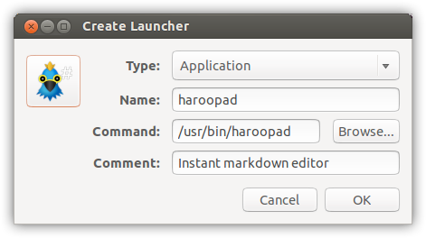

## Create Desktop Shortcuts(Icons) in Ubuntu

우분투용 하루패드는 별도의 아이콘을 생성하지 않고 터미널 상에서 실행할 수 있도록 설치한다. 

그렇다보니 실행할때마다 터미널을 띄워서 `haroopad` 명령을 실행해야 하는 불편함이 있다.

### .Desktop 파일을 생성하는 방법

우분투에서는 haroopad.desktop 파일을 만들어 `~/Desktop/haroopad.desktop` 에 복사해 넣으면 된다.  물론 haroopad.desktop 파일에는 아래와 같은 몇가지 값을 설정이 필요하다.

```
[Desktop Entry]
Version=1.0
Type=Application
Terminal=false
Exec=/usr/bin/haroopad
Name[en_CA]=Haroopad
Name=Haroopad
Icon=haroopad.png
```

이것을 수작동으로 하는 것은 약간 바보같은 짓이니 좀더 나은 방법을 찾아보자.

### Create Launcher

먼저 터미널을 띄워보자.

`Ctrl - Alt - T` 를 누르면 터미널이 뜰 것이다.

그리고 런처 생성기(바로가기 아이콘)를 설치해보자. 

```bash
sudo apt-get install --no-install-recommends gnom-panel
```

설치중에 몇 가지 옵션들이 있으나 모두 기본값으로 진행하자.

설치가 완료되었다면 터미널에서 다음과 같이 실행해보자.

```bash
gnome-desktop-item-edit --create-new ~/Desktop
```

아래와 같은 윈도우를 확인할 수 있습니다.



각 필드에 적합한 값을 넣어주고 `OK` 버튼을 누르면 데스크탑에 `/usr/bin/haroopad` 를 실행하는 아이콘이 생성된다.

###references
* [http://www.liberiangeek.net/2011/11/create-desktop-shortcuts-icons-in-ubuntu-11-10-oneiric-ocelot/](http://www.liberiangeek.net/2011/11/create-desktop-shortcuts-icons-in-ubuntu-11-10-oneiric-ocelot/)