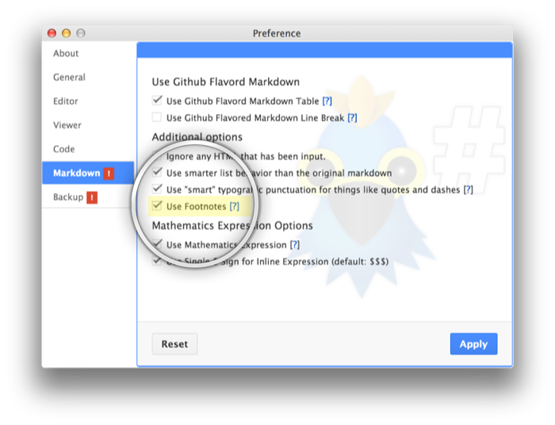

# How to write footnote

## Footnotes

먼저 각주(footnote)는 글을 작성할 때 너무 길어 본문에 기입하기 부적당할 때 사용되며, 대개 기술해야하는 내용의 출처를 밝히는 데 사용된다.

## Footnote Syntax

마크다운에서 각주는 다음과 같이 문장내에 기입되는 각주 참조와 각주가 쌍으로 구성됩니다.

```markdown
That's some text with a footnote.[^1]

[^1]: And that's the footnote.
```

두가지의 표현법은 약간의 차이가 있습니다.

**마크다운 표현법**

```markdown
That's some text with a footnote. [^identifier]

That's some text with a footnote. [^123]

That's some text with a footnote. [^abcd]
```

위와 같이 각주 참조를 지정할 때는 꼭 숫자 넘버링이 아닌 고유한 식별자를 지정하면 됩니다.

```markdown
[^123]: And that's the footnote.
[^abcd]: And that's the footnote.
```

**결과**

That's some text with a footnote. [^identifier]

That's some text with a footnote. [^123]

That's some text with a footnote. [^abcd]

위의 내용중 첫번째 `[^identifier]` 는 `[^indentifier]: footnote` 라는 각주 참조가 기입되지 않아 각주로 인식되지 않고 이런 경우는 텍스트로 그대로 출력됩니다.

그리고 고유한 식별자를 지정한 각주의 경우라도 출력될 때에는 숫자 포맷으로 번호가 지정되어 출력됩니다.

## Preference

각주 기능은 기본 설정값이 "사용하지 않음"으로 설정되어 있습니다. 다음과 같이 "사용함" 으로 체크한 후 "적용" 버튼을 클릭하면 적용됩니다.




## 유의 사항

마크다운 문서나 웹 문서에는 페이지의 개념이 없기 때문에 각주의 위치를 페이지 단위로 지정할 수 없습니다. 그래서 일반적으로 각주는 문서를 기준으로 가장 아래에 표시되고 마크다운 문서 제일 하단에 작성하기를 권장합니다.


[^123]: And that's the 123's footnote.

[^abcd]: And that's the abcd's footnote.