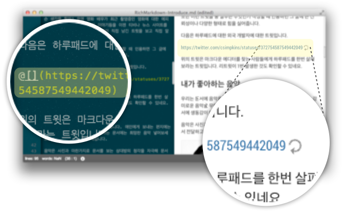
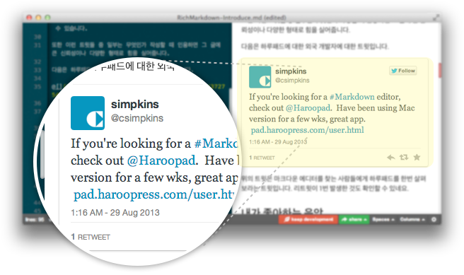

# Rich Media Smart Embeding

> 이 기능은 0.8 부터 추가된 기능입니다.

`@[]()` 문법은 Haroopad Flavored Markdown(이하 HFM) 이다.



우리는 현대적인 문서를 작성하다보면 웹 상에 무수히 많은 콘텐츠를 인용하거나 활용하곤 한다.

또한 과거의 데이터 저장소가 개인의 컴퓨터였고 점차 웹과 클라우드 환경으로 이동하고 있다. 하루패드는 이런점을 감안해 이미 오픈된 수 많은 미디어 콘텐츠를 마크다운의 특징에 융화하여 문서로 표현할 방법을 간단한 문법으로 정했다.

그것이 바로 `@[]()` 문법이다.

### 콘텐츠 임베딩 문법의 이해

마크다운의 특징만큼 매우 간단하다. 느낌표(!)는 이미지 콘텐츠이고 골뱅이(@) - At Sign 은 좀더 폭넓은 미디어 콘텐츠라고 이해하면 좋다.

```markdown
@[caption](content-url 'style')
```

이 문법의 구조는 이미지 표현식 `` 과 유사하지만 마지막 요소에 지정하는 값이 다르다.
콘텐츠 임베딩 문법에서 마지막 값은 CSS(Cascading Style Sheet)이다.

```markdown
@[caption](content-url 'width:300px;margin:1em')
```

콘텐츠 주소를 적어주면 하루패드는 자동으로 주소를 분석해 해당 콘텐츠를 문서내에 임베딩하고 위에서 지정한 스타일을 적용한다. 자 그럼 임의의 트윗을 문서에 추가해보자.

```markdown
@[caption](https://twitter.com/haroopad/status/337257711827841024)
```

**결과**



블로그에서 자주 보던 트윗 임베딩이 된 것을 확인 할 수 있다.

마지막으로 캡션을 살펴보자.
꼭 넣어야 하는 값은 아니지만 넣어주면 좋다.

이 콘텐츠들은 인터넷이 된다는 가정하에 웹에 있는 데이터를 그대로 가져오는 것이기 때문에 만약 인터넷이 되지 않는다면 로딩 표시만 보이게 될 것이다.

또한 인터넷이 되더라도 잘못된 주소로 접근하거나 지원되지 않는 서비스를 접근했을 때 캡션이 이용된다.

```markdown
@[하루패드 첫번째 트윗](https://twitter.com/haroopad/status/337257711827841024)
```

이렇게 되면 콘텐츠를 표시할 수 없을 때 하루패드는 `[하루패드 첫번째 트윗](주소)` 와 동일하게 문서상에 링크로 대체해 표시한다.

자 이렇게 문법의 사용법에 대해서 알아봤다.

### 지원되는 서비스

지원되는 서비스는 별도의 페이지를 통해 관리될 예정이다. 아마 우리가 알고 있는 주요 서비스는 대부분 지원하니 무심코 콘텐츠 주소를 넣어보자.

### 예시 문서

* [Babara Palvain](http://pad.haroopress.com/page.html?f=samples)
