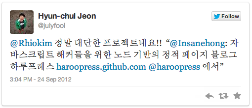

## Multi Markdown

깃허브가 그랬듯이 사실상 표준인 마크다운에는 복잡한 문서를 표현하는데 한계가 있다. 문서 도구에서 쉽게 표현하는 테이블이 하나의 예이다. 


[존 그루버][gruber]가 제안한 마크다운에는 테이블(표)에 대한 정의는 없다. 그래서 마크다운을 즐겨쓰는 깃허브와 커뮤니티에서는 테이블을 표현하기 위한 마크다운을 제안하여 사용하고 있다.

**markdown**  
```markdown
column name | value
------------|-------
row1        | 123
row2        | 456
```

위와 같은 마크다운 문법은 아래와 같이 표로 나타난다.

**result**  
column name | value
------------|-------
row1        | 123
row2        | 456

테이블뿐만 아니라 코드 하이라이팅이 가미된 코드 블럭(fenced code block)이라들지 이미지 요소의 정렬, 각주 등 좀더 고급스러운 문서 표현을 위한 실험과 제안을 아끼지 않고 있다.

특히 Github 의 [GFM(Github Flavored Markdown)](https://help.github.com/articles/github-flavored-markdown) 를 보면 그루버의 문서에 존재하지 않는 유용한 스펙과 그 쓰임새에 대해서 설명하고 있다.

하지만 한가지 문제가 있다면 서비스 종속적인 내용들도 함께 포함하고 있다는 것인데 Emoji, Issue, Task, Refeneces 와 같은 것들이 그렇다.  이런 것들은 표준 마크다운까지의 경계를 넘어서 서비스의 편의를 위한 **확장 마크다운**이다.

#### Extras Markdown (Plugins)

과거와는 달리 **기록** 이라는 것을 통해 생산된 텍스트, 이미지, 오디오, 영상등의 매체는 디지털화되어 온라인 상에 저장한다.

이런 데이터를 문서에 삽입하는 것은 현 시대에 당연한 일이다. 뿐만 아니라 타인이 생산한 디지털 매체를 손쉽게 보거나 활용할 수도 있다.

하지만 마크다운만으로는 이러한 콘텐츠들을 문서에 포함하기란 쉽지 않다. 

만약 몇일 전 유명 연예인이 올린 트윗을 문서에 포함하고 싶고, 단순하게 텍스트만 복사해서 넣는 것보다 트위터에서 제공하는 위젯 형태로 넣는다면 좀더 사실감 있는 문서가 될 수 있다.

**Extras markdown example**  
```markdown
[tweet:237213915593965568]
```

**result**  


이런 방식을 통해 유튜브, 플리커, 슬라이드 쉐어등과 같이 온라인 콘텐츠를 문서에 첨부 하는 것이 간단해 진다.  더 많은 확장 구문은 [여기](http://haroopress.com/post/support-plugins/)를 참고하세요.


[gruber]: http://en.wikipedia.org/wiki/John_Gruber